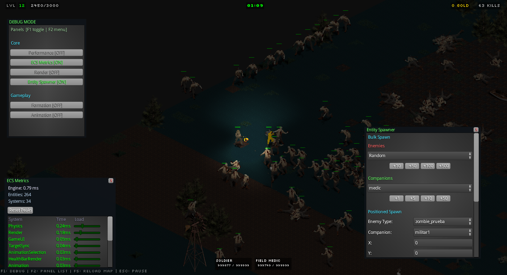

# ProyectoM

**Status:** Active development — still being built.

A 2.5D top-down zombie shooter with pre-rendered graphics. Built in **Java** with **LibGDX**, **Ashley ECS**, and **Box2D**.

---

> **For reviewers:** This README is a guided tour. The two sections below — [How Enemies and Companions Are Built](#how-enemies-and-companions-are-built) and [How the Weapon System Works](#how-the-weapon-system-works) — link directly to the relevant files. Start there.

---

## Running the Project

A pre-built release is available in the [Releases](../../releases) tab. Download and run it directly — no Java install required.

To build from source: `./gradlew lwjgl3:run`. Note the game assets are not included in this repo, so a source build will compile but crash on startup.

---

## Enemies and Companions

Enemies and companions are defined entirely in JSON — there is no Java class per type. At startup, [`EnemyRegistry`](core/src/main/java/io/github/proyectoM/registry/EnemyRegistry.java), [`CompanionRegistry`](core/src/main/java/io/github/proyectoM/registry/CompanionRegistry.java), and [`WeaponRegistry`](core/src/main/java/io/github/proyectoM/registry/WeaponRegistry.java) parse their respective files and store typed templates indexed by ID.

The data files:

- [`enemies.json`](core/src/main/resources/data/enemies.json) — 13 enemy types with stats, atlas path, and a `weaponId`
- [`companions.json`](core/src/main/resources/data/companions.json) — 8 companion types with rarity weights

The factories that assemble ECS entities from those templates:

- [`AbstractCharacterFactory`](core/src/main/java/io/github/proyectoM/factories/AbstractCharacterFactory.java) — shared base: adds health, physics, animation, inventory, and resolves the `weaponId` into a weapon entity inline
- [`EnemyFactory`](core/src/main/java/io/github/proyectoM/factories/EnemyFactory.java) — applies a difficulty multiplier to stats at spawn time
- [`CompanionFactory`](core/src/main/java/io/github/proyectoM/factories/CompanionFactory.java)

The systems that drive them at runtime:

- [`EnemySpawnerSystem`](core/src/main/java/io/github/proyectoM/systems/enemy/EnemySpawnerSystem.java) — asks the registry for a template by ID, calls `EnemyFactory`, places the entity in the world
- [`WaveSystem`](core/src/main/java/io/github/proyectoM/systems/enemy/WaveSystem.java) — controls spawn timing and wave progression
- [`EnemyMovementSystem`](core/src/main/java/io/github/proyectoM/systems/enemy/movement/EnemyMovementSystem.java) — steers enemies toward the player
- [`EnemySeparationSystem`](core/src/main/java/io/github/proyectoM/systems/enemy/movement/EnemySeparationSystem.java) — pushes overlapping enemies apart
- [`SquadMovementSystem`](core/src/main/java/io/github/proyectoM/systems/companion/movement/SquadMovementSystem.java) — moves companions in formation using offsets from [`FormationCalculator`](core/src/main/java/io/github/proyectoM/systems/companion/movement/FormationCalculator.java)

The character and its weapons are **independent entities** from the start. Adding a new type is a JSON entry, no Java changes.

---

## Weapons

Weapons are ECS entities, not components. They are defined in [`weapons.json`](core/src/main/resources/data/weapons.json) and [`bullets.json`](core/src/main/resources/data/bullets.json), loaded by [`WeaponRegistry`](core/src/main/java/io/github/proyectoM/registry/WeaponRegistry.java) at startup, and assembled by:

- [`WeaponFactory`](core/src/main/java/io/github/proyectoM/factories/WeaponFactory.java) — builds the weapon entity from a template; also creates a muzzle flash sub-entity with a light component
- [`BulletFactory`](core/src/main/java/io/github/proyectoM/factories/BulletFactory.java) — builds a bullet entity with a Box2D body, velocity, and distance tracking

A weapon entity has its own animation, its own [`MuzzlePointComponent`](core/src/main/java/io/github/proyectoM/components/entity/weapon/MuzzlePointComponent.java), and is stored in the holder's [`InventoryComponent`](core/src/main/java/io/github/proyectoM/components/entity/InventoryComponent.java) as a list — so **any character can carry multiple weapons**, each fully independent.

The combat systems that use them:

- [`RangedWeaponSystem`](core/src/main/java/io/github/proyectoM/systems/combat/weapons/RangedWeaponSystem.java) — reads `InventoryComponent`, checks cooldown, resolves muzzle position, spawns a bullet with optional homing
- [`MeleeWeaponSystem`](core/src/main/java/io/github/proyectoM/systems/combat/weapons/MeleeWeaponSystem.java) — damage is applied on `AnimEventType.HIT_FRAME`, not on button press; the hit window is owned by the animation, not a timer
- [`BulletLifeSystem`](core/src/main/java/io/github/proyectoM/systems/combat/BulletLifeSystem.java) — removes bullets on max distance or collision
- [`DamageSystem`](core/src/main/java/io/github/proyectoM/systems/combat/DamageSystem.java) — resolves `PendingDamageComponent` into `HealthComponent`

---

## License

© 2026 Alejandro Gasca. All rights reserved.  
This repository is publicly visible **solely for portfolio and admissions review**.  
No license is granted for use, copying, modification, or distribution.  
See [LICENSE](LICENSE) for full terms.
